<picture>
  <source media="(prefers-color-scheme: dark)"  srcset="assets/banner-dark.svg">
  <source media="(prefers-color-scheme: light)" srcset="assets/banner-light.svg">
  
</picture>

  

  

---

# 💫 About Me:
🔭 I'm currently working on Shipping production backend @ Forvia Global HQ — REST APIs, system integrations, and IT ops across a global automotive network. Also building **factufast** — an AWS serverless platform (Lambda · DynamoDB · S3 · SES · EventBridge · SAM IaC) for electronic invoice generation. 🤝 I'm looking for help with Kafka at real scale · squeezing Databricks beyond what the cert covers 🌱 I'm currently learning **AWS** (Lambda · API Gateway · DynamoDB · S3 · SES v2 · EventBridge · SAM IaC · Amplify) · Azure Databricks · Kubernetes 💬 Ask me about REST API design · RAG systems (FAISS + LangChain + BERT) · SAP BTP · OWASP API Top 10 · how to keep a production system alive when it really doesn't want to be

## 🌐 Socials:
   

# 💻 Tech Stack:

**📝 Programming Languages**

     

**⚙️ Frameworks & Libraries**

           

**🗄️ Databases**

    

**☁️ Cloud & Infrastructure**

        

**🛠️ Tools**

   

# 📊 GitHub Stats:

---

<!-- Proudly created with GPRM ( https://gprm.itsvg.in ) -->
